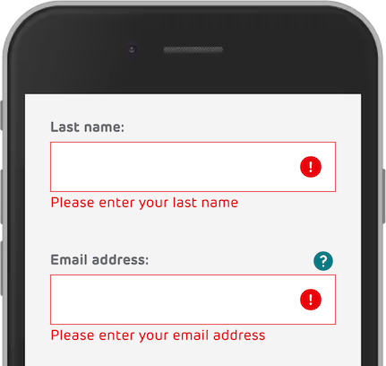
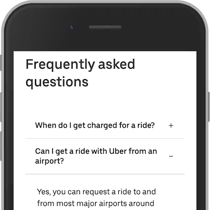

# Semantic Html And Css
simple html and css, if we use only div or span for all of elements, it properly wrong.

## Html Component
HTML only display purpose no logic

### Skeleton

look like tree `<!DOCTYPE html>` is define to HTML V5

`<head>` stand for all meta data lie title scale font etc, also include css file here.

`<body>` main content for display, normally add js script at the end of body before closed tag `</body>`

example:

```html
<!doctype html>
<html lang="en">
  <head>
    ...
    css,
    meta data
    ...
  </head>
  <body>
    ...
    <div></div>
    ...
    <script>
  </body>
</html>
```

### Landmarks

In HTML there are some semantic elements that can be used to define different parts of a web page:

```html
<header />
<nav />
<main />
<aside />
<section />
<footer/>
```

normally one page only have one header, one main, and one footer

`<aside>` vs `<section>`

<aside> is related to the main content and the <section> is not related.

if we have multiple sections we should add `aria-label="contract section"` for `web accessibility`

### Button and Link

The `<button>` element should be used for any interaction that performs an action on the current page. The `<a>` element should be used for navigation to another page.

#### Good Example

`How to eat healthy`

#### Bad

`Click Here`

`See more`

#### Heading

Headings should be relationships between different sections eg. `<h1>` used for main headings, followed by `<h2>` headings, then the less important `<h3>`, and so on.

### Image
Image mostly use today, normally image has two type, Decorative and Meaningful.

Image `` which `` mean screen render will not read this image if the image is important we need to describe alt.

### Web Accessibility

for Help abnormal people can use our web, if we use semantic it already have correct role (in many CSS framework like Mui handle this for us) like;

- button has role="button"
- a has role="link"
- nav has role="navigation"

what if we use create custom element like div? we can manual add `<div role="button">` to screen-reader can read.

### Form Element

HTML form is used to collect user input. Basic is `<input>`, `<label>`, `<fieldset>`, `<select>` etc...

#### Label

The `<label>` element is useful for screen-reader users, because the screen-reader will read out loud the label when the user focus on the input element.

```html
<label for="customerType">Who are you buying for today?</label>
<select name="customerType" id="customerType"></select>
```

What if no label (Like Mui TextField)
normally we add placeholder but it not enough for Woke people.
so we add aria-label for screen-reader

`<input placeholder="Enter search term" aria-label="Enter search term">`

#### Required Field

add aria-required for screen-reader

```html
<label for="email">Your email address <span class="mandatory">*</span></label>
<input
	id="email"
	name="email"
	required
	aria-required="true"
	placeholder="Email"
	required=""
/>
```

#### Group form?

use legend and fieldset

```html
<fieldset>
	<legend>Your date of birth</legend>
	<label for="dobDay">Day</label>
	<select id="dobDay">
		…
	</select>
	<label for="dobMonth">Month</label>
	<select id="dobMonth">
		…
	</select>
	<label for="dobYear">Year</label>
	<input id="dobYear" type="text" placeholder="YYYY" />
</fieldset>
```

#### Autocomplete

```html
<input
	id="email"
	autocomplete="email"
	name="email"
	aria-required="true"
	placeholder="Email"
	required
/>

<select id="dobDay" autocomplete="bday-day" aria-required="true" required>
	<select id="dobMonth" autocomplete="bday-month" aria-required="true" required>
		<input
			id="dobYear"
			autocomplete="bday-year"
			placeholder="YYYY"
			aria-required="true"
			required
		/>
	</select>
</select>
```
ref all field name: https://www.w3.org/TR/WCAG21/#input-purposes

#### Error Message

Form needs error messages that is perceivable and understandable

- First add role="alert"
- Second make it close together to input
- Third add two aria, `aria-describedby` to the id of error element and `aria-invalid="true"`
- Final move focus to first invalid field.

example

```html
<input
	name="firstName"
	id="firstNameInput"
	type="text"
	pattern="[^.]*?"
	aria-describedby="firstName-length-error"
	aria-invalid="true"
/>

<p id="firstName-length-error" role="alert">
	Your first name must have at least two letters and no unusual characters
</p>
```




### Text Size & Image Type
Use `rem` instead of fix with `pixel` for support chrome config font and zoom page.
```css
.model-name {
  font-size: 1.125rem;
}
```

line-hight use with out unit

```css
.text {
	line-hight: 1.5
}
```

Use vector graphics like `SVG` instead of raster graphics like `PNG`


### Color Contrast
Use https://www.siegemedia.com/contrast-ratio
measure contrast between text or graphics against the background color, we should have minimum value with 4.5, 7 is more useful
(black and white is about 21)


### Custom Element Especially div tag
Do not forget to add role name

example accordion (collapse/expand)



```html
<div role="button">When do I get charged for a ride? (plus icon)</div>
```

tell a screen render it is closed

```html
<div role="button" aria-expanded="false">When do I get charged for a ride? (minus icon)</div>
```

